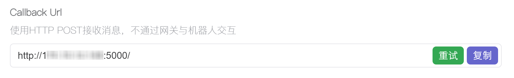

# KOOK 机器人 项目

[]()

## 用法

```shell
conda create -n kookbot python=3.12
conda activate kookbot
pip install -r requirements.txt

# 设置环境变量 都可以在kook后台机器人概况页面获得
# Linux
export KOOK_BOT_ID=xxxxxxxx  # bot id
export KOOK_BOT_TOKEN=xxxxxxxxxxxxxxxxxxxxxxxx  # bot token
export KOOK_ENCRYPT_KEY=xxxxxxxx  # encrypt key
# Windows
set KOOK_BOT_ID="xxxxxxxx"
set KOOK_BOT_TOKEN="xxxxxxxxxxxxxxxxxxxxxxxx"
set KOOK_ENCRYPT_KEY="xxxxxxxx"

python api.py

```
### 在机器人后台选择 webhook 模式
使用内网穿透或者公网IP

后台填入你的 回调url (Callback Url) 例如 `http://api.your.ip:5000/`

点击重试


## 项目结构

```
Project
└─KOOKBOT
    │  api.py           # Flask 路由、守护进程
    │  env.py           # 环境变量获取
    │  event.py         # 事件分发和处理
    │  models.py        # KOOK 模型实现
    │  README.MD
    │  requirements.txt
    └─ util.py          # 工具库
``` 

